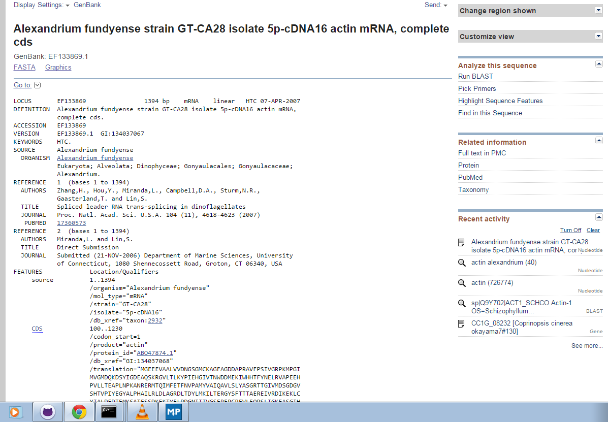

#My Favorite Gene

##Actin

by Armando Mendoza - [@armandomaxfli](https://github.com/armandomaxfli)


####Is it in the Geoduck transcriptome?
---
The first thing I did was get a sequence from GenBank in a species with fully annotated genome

This is a screenshot or the NCBI page



There is a direct link to the page [http://www.ncbi.nlm.nih.gov/nuccore/EF133869.1](http://www.ncbi.nlm.nih.gov/nuccore/EF133869.1)

##Blasting against Geoduck database

my code

```
!blastp \
-query ../../big-data/blast/db/alexandrium-actin.fasta \
-db ../../big-data/blast/db/uniprot \
-out ../../big-data/blast/out/alexandrium-actin.out
```

Here is the top hit for GeoDuck Male

```
gi|568002104|gb|AHC98023.1|	Geo_Pool_M_CTTGTA_L006_R1_001_val_1_(paired)_contig_250	79.55	132	27	0	1	132	539	144
```


 


 


